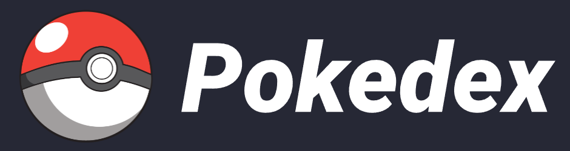

# PokedexApp
> PokedexApp é um aplicativo Frontend que lista informações dos principais Pokemons.
> Projeto desenvolvimento em NodeJS e Angular que lista pokemons utilizando a [PokeApi](https://pokeapi.co/)

## Índice

-   [Sobre](#sobre)
      - [Descrição](#descrição)
      - [Funcionalidades](#funcinalidades)
      - [Ferramentas utilizadas](#ferramentas-utilizadas)    
-   [Instalando](#instalando)
      -   [Instalando localmente](#instalando-localmente)
      -   [Instalação com Docker](#instalação-com-docker)
-   [Executando](#executando)
      -   [Linux](#executando-no-linux)
      -   [Windows](#executando-no-windows)

## Sobre
> Conheça mais sobre o projeto

### Descrição

O projeto foi proposto durante um curso de Angular 15.

O PokedexApp te ajuda a buscar por Pokemons e visualizar informações detalhadas sobre eles.

### Funcionalidades

:heavy_check_mark: `Funcionalidade 1:` Visualizar lista de Pokemons.
:heavy_check_mark: `Funcionalidade 2:` Pesquisar por seu Pokemon favorito.
:heavy_check_mark: `Funcionalidade 3:` Ver informações detalhadas sobre os Pokemons.

### Ferramentas utilizadas

    

## Instalando

> Como instalar projeto e suas dependências

### Instalando localmente

#### :leftwards_arrow_with_hook: Pré-requisitos

1. [NodeJS 16.15 ou superior](https://nodejs.org/en/download/) - _Interpretador que permite executar JS fora do navegador_
2. [Angular 15 ou superior](https://angular.io/cli) _(npm install -g @angular/cli)_ - _Ferramenta de desenvolvimento web_

#### :arrow_down: Baixando e Instalando

1. Baixe o projeto [aqui](https://github.com/hc-pedrosouza/pokedex-app/archive/refs/heads/master.zip)
2. Extraia o arquivo .zip
3. Abra a pasta do extraida anteriormente no CMD/Terminal 
1. No terminal:
    - Digite `npm i`

### Instalando com Docker

#### :leftwards_arrow_with_hook: Pré-requisitos

1. [WSL2](https://learn.microsoft.com/pt-br/windows/wsl/install) - Windows Subsystem Linux 2
    > :exclamation: **Atenção**: Somente para sistema operacional Windows
1. [Docker](https://www.docker.com/products/docker-desktop/) - Serviços de virtualização de containers
    > :exclamation: **Atenção**: Para o sistema operacional Linux será necessário que seu usuário esteja incluso no arquivo de **suders**
    - :anger: **Erro:** ' _Is not a docker command_ '
        - [Windows](https://www.mydatabase.com.br/index.php/71-categorias/docker/212-manual-do-usu%C3%A1rio-do-docker-desktop-para-windows) - Use Docker Compose V2
        - [Linux](https://docs.docker.com/engine/install/ubuntu/) - Install Docker Engine on Ubuntu

#### :arrow_down: Baixando e Instalando

1. Baixe o projeto [aqui](https://github.com/hc-pedrosouza/pokedex-app/archive/refs/heads/master.zip)
2. Extraia o arquivo .zip
3. Abra a pasta do extraida anteriormente no CMD/Terminal 
1. No terminal:
    - Digite `cd docker && docker compose up -d --build`

## :rocket: Executando

> Passo a passo de como executar o projeto

### Executando no Linux

1. Abra a pasta do projeto no terminal
1. No terminal:
    - Digite `npm run start`
1. No navegador
    - Acesse a URL -> **http://localhost:4200**

### Executando no Windows

1. Abra a pasta do projeto no CMD
1. No terminal:
    - Digite `npm run start`
1. No navegador
    - Acesse a URL -> **http://localhost:4200**